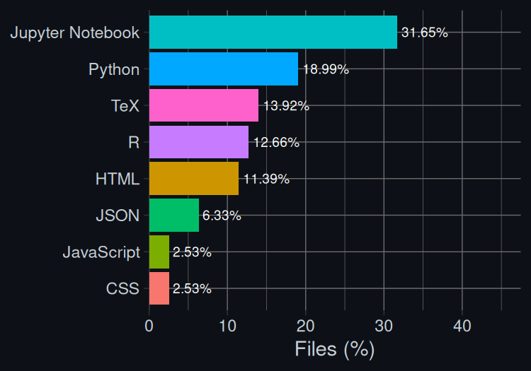

# 👋 Hi, I’m Utpalraj Kemprai

Welcome to my GitHub profile! I’m someone still figuring things out — drawn to the logic of mathematics, the patterns in data, and the occasional beauty of a well-fit model. While my curiosity isn’t always burning at full throttle, I keep going — learning bit by bit, sometimes out of passion, sometimes out of discipline. I don’t romanticize the grind, but I do find small joys in building, understanding, and making things work (especially when paired with a good anime OST in the background).

- 👀 Interests: Statistics, Causal Inference, AI/ML, and quietly judging plots with poor axis labels  
- 🌸 Also Interests: Anime, Video games,Japanese music (yes, Chilli Beans supremacy), and the eternal question — "Sub or Dub?" (Sub. Always.)

---

## 📊 GitHub Stats

---

## 🛠️ Technologies & Tools

- **Languages:** Python, R, Julia, SQL  
- **Libraries/Frameworks:** NumPy, Pandas, Scikit-Learn, PyTorch, TensorFlow, NLTK, OpenCV, Streamlit, Flask, R Shiny, R Tidyverse  
- **Visualization:** Matplotlib, Seaborn, Plotly, ggplot2, Power BI (when Excel just won't cut it)  
- **Databases:** MySQL  

> Occasionally abuses `plt.style.use("seaborn")` like it's a personal aesthetic.

---

## 🎓 Education

- **B.Math (Hons.)** – Indian Statistical Institute, Bangalore  
- **M.Sc Data Science** – Chennai Mathematical Institute (coursework done, existential dread ongoing)

---

## 🌱 Currently Exploring

- Survival Analysis with R (because why let lifetimes be boring?)  
- Causal Inference (a.k.a., "Did X really cause Y or are we just imagining things?")  
- Japanese (slowly — anime subtitles are still doing most of the heavy lifting)

---

## 💬 Anime, Manga & Music Corner

- Favorites: *Kara no Kyōkai*, *Hayate no Gotoku!*, *Millennium Actress*, *Samurai Flamenco*, *Dungeon Maeshi*, *Chainsaw Man*  
- Waifu Tier: Ruka Suirenji & Katsura Hinagiku (fight me)  
- Listening to: Chilli Beans, Tomoo, Cody Lee, and yes, the *本日、満開ワタシ色！* ED on repeat  
- Mood: Somewhere between melancholic anime outro and shonen power-up scene

---

## 📫 Let's Connect

- **Email:** [utpalrajkemprai2001@gmail.com](mailto:utpalrajkemprai2001@gmail.com)  
- **LinkedIn:** [linkedin.com/in/utpalraj-kemprai](https://www.linkedin.com/in/utpalraj-kemprai-89245a251/)  
- **[My Home Page](https://u1kemp.github.io)**

---

<!---
U1Kemp/U1Kemp is a ✨ special ✨ repository because its `README.md` (this file) appears on your GitHub profile.
You can click the Preview link to take a look at your changes.
--->
