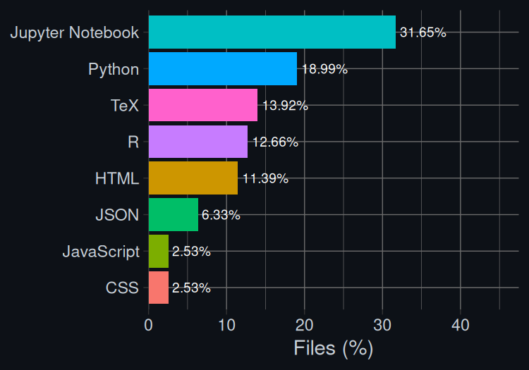

# 👋 Hi, I’m Utpalraj Kemprai

Welcome to my GitHub profile. Currently, I’m stepping back from the constant "exploration" of the tech world. I’m not actively pursuing new projects in Data Science, AI/ML, Statistics, or Data Engineering at this time. I value the logic and patterns I've learned, but for now, I’m prioritizing a quieter, more observant pace.

- ⏸️ Status: Not currently exploring new tech domains or active projects.
- 🌸 Focus: Finding quiet moments in anime, gaming, and Japanese music.

---

## 📊 GitHub Stats

---

## 🛠️ Established Stack

These are the tools I have worked with and understand, though I am not currently building with them:

- **Languages:** Python, R, SQL  
- **Core Libraries:** NumPy, Tidyverse, Pandas, Scikit-Learn, NLTK, PyTorch, Tensorflow, OpenCV, Streamlit, Flask, Shiny
- **Visualization:** Matplotlib, ggplot2, Seaborn, Plotly

---

## 🎓 Background

- **B.Math (Hons.)** – Indian Statistical Institute, Bangalore  
- **M.Sc Data Science** – Chennai Mathematical Institute (coursework done, existential dread ongoing)

---

## 💬 Anime, Manga & Music Corner

- `Favorites`: *Spy x Family*, *Kara no Kyōkai*, *Hayate no Gotoku!*, *Millennium Actress*, *Samurai Flamenco*, *Dungeon Maeshi*, *Chainsaw Man* and more. 

- `Waifu Tier`: *Ruka Suirenji* & *Katsura Hinagiku* (fight me).

- `Listening to`: *Chilli Beans*, *One Ok Rock*, *Tomoo*, *Cigarettes After Sex* and yes, the *本日、満開ワタシ色！* ED on repeat.  

- `Mood`: Somewhere between melancholic anime outro and shonen power-up scene

---

## 📫 Contact

- **[Email](mailto:utpalrajkemprai2001@gmail.com)**  
- **[My Home Page](https://u1kemp.github.io)**
- **[LinkedIn](https://www.linkedin.com/in/utpalraj-kemprai-89245a251/)**
---
